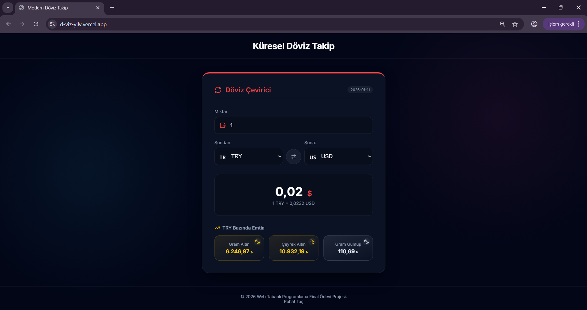

# 🌍 Küresel Döviz & Altın Takip Sistemi

Bu proje, **Web Tabanlı Programlama** dersi final ödevi olarak **Rojhat Taş** tarafından geliştirilmiştir. Modern web teknolojileri kullanılarak hazırlanan uygulama, anlık döviz kurları ve emtia (altın/gümüş) fiyatlarını takip etmeyi ve çapraz kur hesaplamaları yapmayı sağlar.



## 🚀 Özellikler

* **Canlı Döviz Çeviri:** Tüm dünya para birimleri arasında anlık çapraz kur hesaplama.
* **Emtia Takibi:** Gram Altın, Çeyrek Altın ve Gümüş fiyatlarının seçili para birimine göre (USD, TRY, EUR vb.) otomatik hesaplanması.
* **Dinamik Arayüz (Glassmorphism):** Buzlu cam efekti ve modern CSS teknikleri ile şık tasarım.
* **Akıllı Tema:** Seçilen para birimine göre (Örn: TRY için kırmızı, USD için mavi) değişen renk temaları ve bayraklar.
* **Swap (Değiştir) Özelliği:** Kaynak ve hedef para birimini tek tuşla yer değiştirme.

## 🛠️ Kullanılan Teknolojiler

* **Framework:** [Next.js](https://nextjs.org/) (React)
* **Dil:** JavaScript (ES6+)
* **Stil:** CSS3 (Custom Properties, Glassmorphism, Responsive Design)
* **İkon Seti:** [Lucide React](https://lucide.dev/)
* **Veri Kaynağı (API):** Fawaz Ahmed Currency API

## 🔗 Kullanılan API Bilgisi

Projede döviz ve emtia verilerini çekmek için açık kaynaklı ve ücretsiz bir API kullanılmıştır. Bu API, JSON formatında güncel verileri sağlar.

* **API Sağlayıcısı:** [@fawazahmed0/currency-api](https://github.com/fawazahmed0/currency-api)
* **Örnek İstek URL'i:** `https://cdn.jsdelivr.net/npm/@fawazahmed0/currency-api@latest/v1/currencies/usd.json`

## 💻 Kurulum ve Çalıştırma

Projeyi kendi bilgisayarınızda çalıştırmak için aşağıdaki adımları izleyebilirsiniz:

1.  **Projeyi Klonlayın:**
    Proje dosyalarını bilgisayarımıza indirelim.
    ```bash
    git clone ...
    cd (projenin olduğu dizin)
    ```

3.  **Gerekli Paketleri Yükleyin:**
    ```bash
    npm install
    ```

4.  **Geliştirme Sunucusunu Başlatın:**
    ```bash
    npm run dev
    ```

5.  **Tarayıcıda Görüntüleyin:**
    Tarayıcınızda `http://localhost:3000` adresine gidin.

## 📷 Ekran Görüntüleri

### Ana Ekran ve Çevirici


---
**Geliştirici:** Rojhat Taş  
**Tarih:** Ocak 2026
